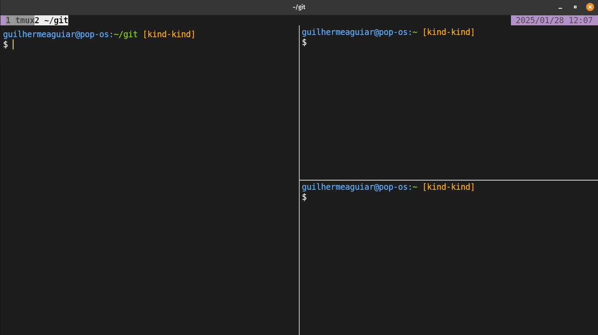

# 😼 Kitty Configurations

Este repositorio contem as configurações do meu terminal [kitty](https://sw.kovidgoyal.net/kitty/)

---

##   Estrutura

- `kitty.conf`: Arquivo de configuração do kitty.
- `kitty-icon`: Diretorio onde tem imagem do icone do kitty.

---

